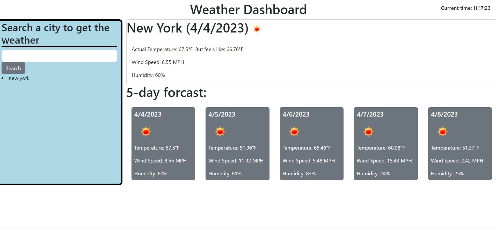

## Weather Dashboard
Welcome to the Weather Dashboard! This web application provides current and future weather conditions for any city of your choice.

# Features
Search for a city: Enter the name of the city you want to get weather information for in the search bar and click on the "Search" button. The current and future conditions for that city will be displayed, and the city will be added to the search history.
View current weather conditions: After searching for a city, you will see the city name, the date, an icon representation of weather conditions, the temperature, the humidity, and the wind speed on the screen.
View future weather conditions: In addition to the current weather conditions, you can also see the 5-day forecast that displays the date, an icon representation of weather conditions, the temperature, the wind speed, and the humidity.
Click on a city in the search history: If you want to see the weather information for a city you searched for earlier, click on that city in the search history. The current and future conditions for that city will be displayed again.

# How to Use
Open the web application in your browser.
Enter the name of the city you want to get weather information for in the search bar and click on the "Search" button.
The current and future weather conditions for that city will be displayed.
To see the weather information for a city you searched for earlier, click on that city in the search history.

# Technologies Used
HTML
CSS
JavaScript
OpenWeather API

# Credits
This project was created by [Your Name] as part of a coding bootcamp. The weather data is provided by the OpenWeather API.

# deployed site
https://jonny258.github.io/Weather-app-API/

